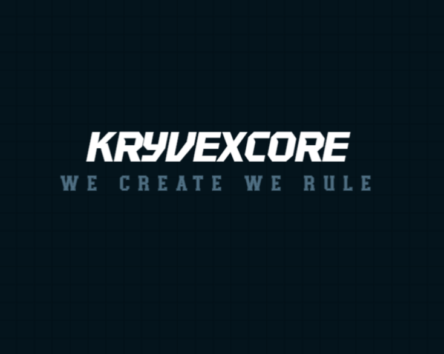

### We Create. We Rule.

**Building software that ships, scales, and lasts.**

 

## 👋 About Us

**Kryvexcore** is a software development studio focused on designing and building reliable digital products — from web platforms and mobile apps to backend systems and developer tooling. We work with startups and businesses to turn ideas into production-ready software, end to end.

We're a small, senior team that cares about clean architecture, honest timelines, and software that keeps working after launch.

 

## 🛠️ What We Do

| Service | Description |
|---|---|
| **Web Development** | Full-stack web apps and platforms — React/Next.js frontends, robust APIs and backends |
| **Mobile Development** | Native and cross-platform mobile apps (iOS, Android, React Native) |
| **Backend & Infrastructure** | API design, databases, cloud architecture, DevOps and CI/CD pipelines |
| **Product Engineering** | MVP development, technical consulting, and long-term product partnerships |
| **Custom Software** | Internal tools, automation, and bespoke systems built around your workflow |

 

## 🚀 Featured Projects

<!-- Replace with your real repos/case studies -->
| Project | Description | Stack |
|---|---|---|
| [`project-one`](https://github.com/kryvexcore/project-one) | Short one-line description of the project | `TypeScript` `Next.js` `PostgreSQL` |
| [`project-two`](https://github.com/kryvexcore/project-two) | Short one-line description of the project | `Python` `FastAPI` `Docker` |
| [`project-three`](https://github.com/kryvexcore/project-three) | Short one-line description of the project | `React Native` `Firebase` |

 

## 💻 Tech We Work With

 

## 📊 Org Stats

 

## 🤝 Work With Us

We take on a limited number of client projects and partnerships at a time. If you have an idea, a product to build, or a system that needs engineering — get in touch.

- 🌐 **Website:** [kryvexcore.com](https://kryvexcore.com)
- 📧 **Email:** [kryvexoperations@gmail.com](mailto:kryvexoperations@gmail.com)
- 🐦 **X / Twitter:** [@kryvexcore](https://twitter.com/kryvexcore)
- 💼 **LinkedIn:** [Kryvexcore](https://linkedin.com/company/kryvexcore)

 

**Kryvexcore** — We Create. We Rule.

